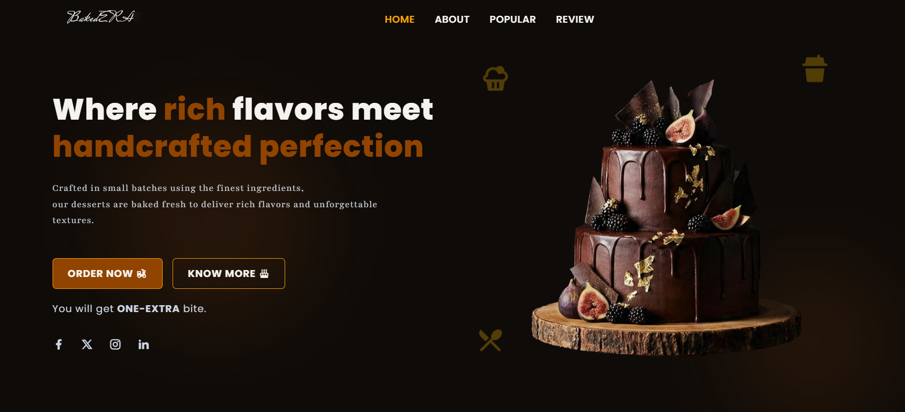
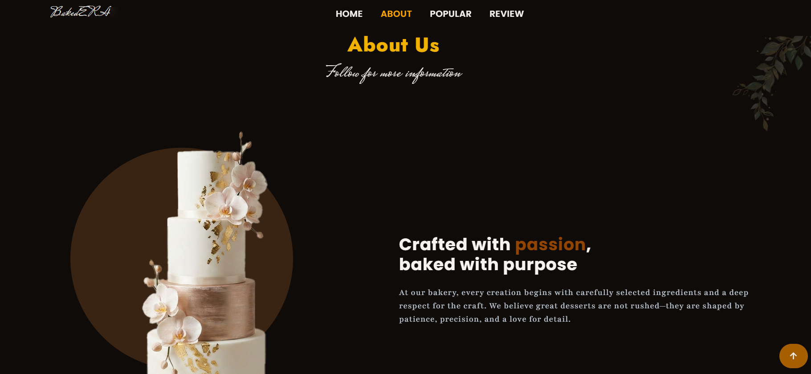
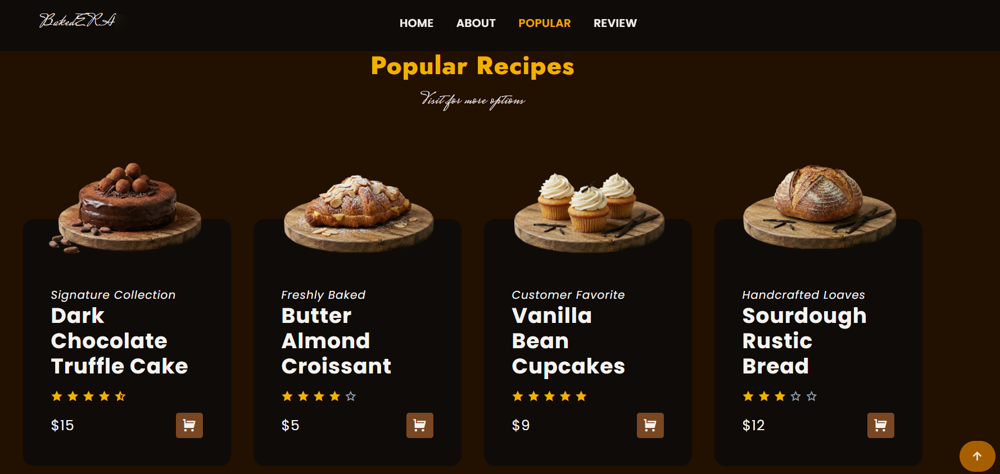
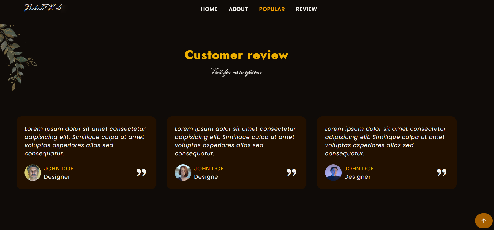
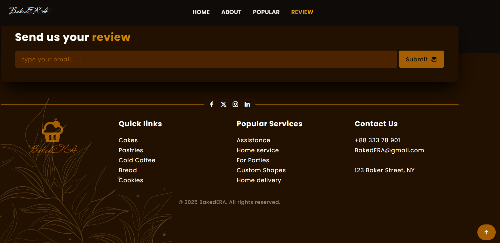

## 🍰 BAKedERa — Dark Bakery Website

A modern, dark-themed bakery website designed with a premium and Gen-Z friendly aesthetic.  
This project focuses on clean layouts, strong typography, and a luxurious food presentation inspired by artisan desserts.

---

## ✨ Features

- 🌙 Dark & modern UI design
- 🍫 Premium bakery theme (cakes, pastries, desserts)
- 🧁 Clean product cards with ratings & pricing
- 🪟 Glassmorphism effects for a modern look
- 📱 Fully responsive layout
- 🎨 Custom color palette inspired by luxury desserts
- ⚡ Smooth hover interactions & transitions

---

## 🛠️ Built With

- **HTML5**
- **Tailwind CSS**
- **JavaScript**
- **Remix Icons**

---

## 🎨 Design Concept

The design is inspired by:
- Dark luxury aesthetics
- Artisan bakery branding
- Chocolate, cocoa, and gold tones
- Modern Gen-Z friendly UI trends

The goal was to create a visually rich experience that feels premium, minimal, and professional.

---

## 📸 Screenshots

  
  

  
  

  

